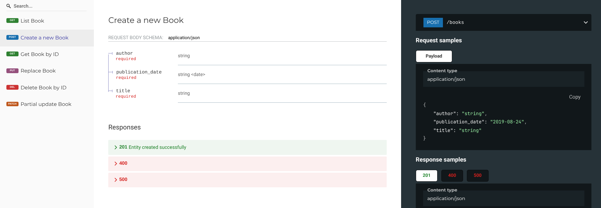

# Overview

LazyBE (Lazy Backend) is a collection of building blocks for quickly building a backend CRUD application.
It provides macros and trait implementations that can be composed without being too opinionated about how to structure your application.

A typical backend application usually has boring parts, where you just need to do basic CRUD, and fun parts, where you get to do crazy stuff.
LazyBE lets you skip the boring parts and focus on the fun ones.

## Features

- Derive the data access layer from a struct
  - Uses `sea-query` and `sqlx` under the hood, which means you can use `Postgres` and `SQLite` (no `MySQL` support yet, but adding it should be trivial)
  - Automatically handles `created_at` and `updated_at` timestamps
  - See [Minimal DAL example](./examples/kitchen-sink/examples/dal_minimal.rs)
- Derive `axum` endpoints from a struct (See [Minimal API example](./examples/kitchen-sink/examples/api_minimal.rs))
- Derive OpenAPI specification from a struct (See [Todo example](./examples/todo))
- Custom validation support (See [Validation example](./examples/kitchen-sink/examples/api_validation.rs))
- Custom ID generation (See [Custom ID example](./examples/kitchen-sink/examples/dal_custom_id.rs))
- Custom collection API support filter, sort, pagination (See [Collection API example](./examples/kitchen-sink/examples/api_pagination.rs))
- Built-in support for JSON field (See [JSON example](./examples/kitchen-sink/examples/dal_json.rs))

## A quick glance

Here’s a quick glance at what LazyBE looks like.

```rust
#[derive(Debug, Clone, Serialize, Deserialize, Entity, ToSchema)]
#[lazybe(table = "book", endpoint = "/books", derive_to_schema)]
pub struct Book {
    #[lazybe(primary_key)]
    pub id: u32,
    pub title: String,
    pub author: String,
    pub publication_date: NaiveDate,
    #[lazybe(created_at)]
    pub created_at: DateTime<Utc>,
    #[lazybe(updated_at)]
    pub updated_at: DateTime<Utc>,
}
```

The `Entity` macro derives traits and sibling types to implement commonly used backend layers.

- The attribute `table = "book"` defines the database table used for CRUD operations.
- The optional attribute `endpoint = "/books"` defines the URL path where the resource is exposed.
- The optional attribute `derive_to_schema` ensures that `utoipa::ToSchema` is derived for sibling types.
- The attribute `#[lazybe(primary_key)]` defines the primary key, allowing you to fetch a book by its ID.
- The attributes `#[lazybe(created_at)]` and `#[lazybe(updated_at)]` automatically timestamp when a record is created or updated.

With this macro, the following backend layers are automatically implemented:

1. Data access layer – using `sqlx` and `sea-query`
2. API layer – using `axum` and `serde`
3. OpenAPI specification – using `utoipa`

You can then expose `Book` on a REST API using `axum` like this:

```rust
#[tokio::main]
async fn main() -> anyhow::Result<()> {
    let ctx = SqliteDbCtx;
    let pool = SqlitePool::connect("sqlite::memory:").await?;

    let openapi = OpenApiBuilder::new()
        .info(Info::new("Example", "0.1.0"))
        .servers(Some([Server::new("http://localhost:8080")]))
        .build()
        .merge_from(Book::get_endpoint_doc(None))
        .merge_from(Book::list_endpoint_doc(None))
        .merge_from(Book::create_endpoint_doc(None))
        .merge_from(Book::update_endpoint_doc(None))
        .merge_from(Book::replace_endpoint_doc(None))
        .merge_from(Book::delete_endpoint_doc(None));

    let app = Router::new()
        .merge(Redoc::with_url("/", openapi))
        .merge(Book::get_endpoint())
        .merge(Book::list_endpoint())
        .merge(Book::create_endpoint())
        .merge(Book::update_endpoint())
        .merge(Book::replace_endpoint())
        .merge(Book::delete_endpoint())
        .with_state(AppState { ctx, pool });

    let listener = tokio::net::TcpListener::bind("0.0.0.0:8080").await?;
    tracing::info!("Server is listening on 0.0.0.0:8080");
    lazybe::axum::serve(listener, app).await?;
    Ok(())
}
```

This will generate the following endpoints for the `Book` resource:

- `POST /books` – Create a new book and save it to the `book` table
- `GET /books` – Retrieve a collection of books
- `GET /books/{id}` – Retrieve a book by its ID
- `PUT /books/{id}` – Replace an existing book
- `PATCH /books/{id}` – Partially update an existing book
- `DELETE /books/{id}` – Delete a book by its ID

It will also generate the OpenAPI specification for the `Book` resource and serve it using the Redoc UI.



This is just a high-level overview.
For a complete working example, see the [minimal API example](./examples/kitchen-sink/examples/api_minimal.rs).

# Documentation

The only documentation for now is the [example directory](./examples). There’s no fancy doc site just yet.
